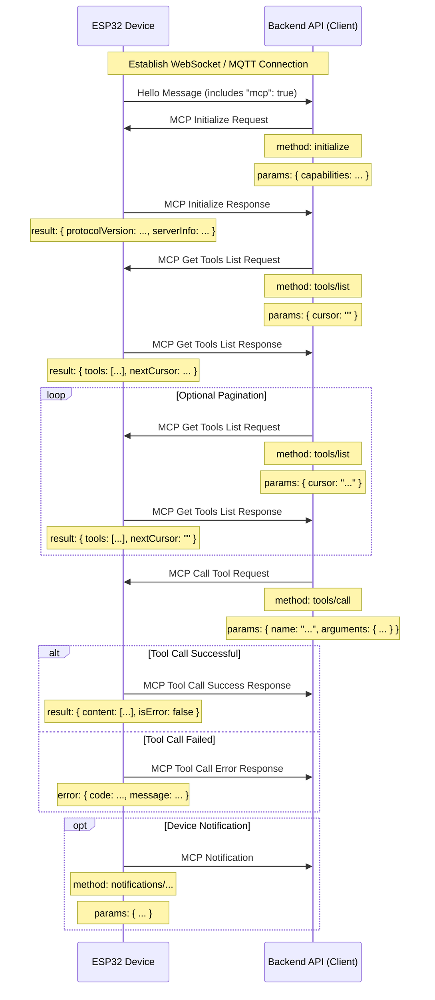

# MCP (Model Context Protocol) Interaction Flow

NOTICE: AI-assisted generation. When implementing backend services, please refer to the code for details!!

The MCP protocol in this project is used for communication between the backend API (MCP Client) and the ESP32 device (MCP Server), enabling the backend to discover and call functionality (Tools) provided by the device.

## Protocol Format

According to the code (`main/protocols/protocol.cc`, `main/mcp_server.cc`), MCP messages are encapsulated within the message body of the base communication protocol (e.g., WebSocket or MQTT). Its internal structure follows the [JSON-RPC 2.0](https://www.jsonrpc.org/specification) specification.

Overall message structure example:

```json
{
  "session_id": "...", // Session ID
  "type": "mcp",       // Message type, fixed as "mcp"
  "payload": {         // JSON-RPC 2.0 Payload
    "jsonrpc": "2.0",
    "method": "...",   // Method name (e.g., "initialize", "tools/list", "tools/call")
    "params": { ... }, // Method parameters (for request)
    "id": ...,         // Request ID (for request and response)
    "result": { ... }, // Method execution result (for success response)
    "error": { ... }   // Error information (for error response)
  }
}
```

The `payload` part is a standard JSON-RPC 2.0 message:

- `jsonrpc`: Fixed string "2.0".
- `method`: Name of the method to be invoked (for Request).
- `params`: Parameters for the method, a structured value, usually an object (for Request).
- `id`: Identifier for the request, provided by the client when sending the request, returned verbatim by the server in the response. Used to match requests and responses.
- `result`: The result of the successful execution of the method (for Success Response).
- `error`: Error information if the method execution fails (for Error Response).

## Interaction Flow and Timing

MCP interaction mainly revolves around the Client (Backend API) discovering and calling "Tools" on the Device.

1.  **Connection Establishment and Capability Announcement**

    - **Timing:** After the device starts up and successfully connects to the backend API.
    - **Sender:** Device.
    - **Message:** The device sends a "hello" message of the base protocol to the backend API, containing a list of capabilities supported by the device, such as supporting the MCP protocol (`"mcp": true`).
    - **Example (Not MCP payload, but base protocol message):**
      ```json
      {
        "type": "hello",
        "version": ...,
        "features": {
          "mcp": true,
          ...
        },
        "transport": "websocket", // Or "mqtt"
        "audio_params": { ... },
        "session_id": "..." // Device might set this after receiving server hello
      }
      ```

2.  **Initialize MCP Session**

    - **Timing:** After the Backend API receives the device's "hello" message and confirms the device supports MCP, usually sent as the first request of the MCP session.
    - **Sender:** Backend API (Client).
    - **Method:** `initialize`
    - **Message (MCP payload):**

      ```json
      {
        "jsonrpc": "2.0",
        "method": "initialize",
        "params": {
          "capabilities": {
            // Client capabilities, optional

            // Vision related
            "vision": {
              "url": "...", // Camera: Image processing URL (must be http address, not websocket)
              "token": "..." // url token
            }

            // ... other client capabilities
          }
        },
        "id": 1 // Request ID
      }
      ```

    - **Device Response Timing:** After the device receives and processes the `initialize` request.
    - **Device Response Message (MCP payload):**
      ```json
      {
        "jsonrpc": "2.0",
        "id": 1, // Matches Request ID
        "result": {
          "protocolVersion": "2024-11-05",
          "capabilities": {
            "tools": {} // Tools details seem not listed here, requiring tools/list
          },
          "serverInfo": {
            "name": "...", // Device Name (BOARD_NAME)
            "version": "..." // Device Firmware Version
          }
        }
      }
      ```

3.  **Discover Device Tool List**

    - **Timing:** When the Backend API needs to get the list of specific functions (Tools) currently supported by the device and their calling methods.
    - **Sender:** Backend API (Client).
    - **Method:** `tools/list`
    - **Message (MCP payload):**
      ```json
      {
        "jsonrpc": "2.0",
        "method": "tools/list",
        "params": {
          "cursor": "" // Used for pagination, empty string for first request
        },
        "id": 2 // Request ID
      }
      ```
    - **Device Response Timing:** After the device receives the `tools/list` request and generates the tool list.
    - **Device Response Message (MCP payload):**
      ```json
      {
        "jsonrpc": "2.0",
        "id": 2, // Matches Request ID
        "result": {
          "tools": [ // List of tool objects
            {
              "name": "self.get_device_status",
              "description": "...",
              "inputSchema": { ... } // Parameter schema
            },
            {
              "name": "self.audio_speaker.set_volume",
              "description": "...",
              "inputSchema": { ... } // Parameter schema
            }
            // ... more tools
          ],
          "nextCursor": "..." // If the list is large and requires pagination, this will contain the cursor value for the next request
        }
      }
      ```
    - **Pagination Handling:** If the `nextCursor` field is not empty, the client needs to send the `tools/list` request again, carrying this `cursor` value in `params` to get the next page of tools.

4.  **Call Device Tool**

    - **Timing:** When the Backend API needs to execute a specific function on the device.
    - **Sender:** Backend API (Client).
    - **Method:** `tools/call`
    - **Message (MCP payload):**
      ```json
      {
        "jsonrpc": "2.0",
        "method": "tools/call",
        "params": {
          "name": "self.audio_speaker.set_volume", // Name of the tool to call
          "arguments": {
            // Tool parameters, object format
            "volume": 50 // Parameter name and value
          }
        },
        "id": 3 // Request ID
      }
      ```
    - **Device Response Timing:** After the device receives the `tools/call` request and executes the corresponding tool function.
    - **Device Success Response Message (MCP payload):**
      ```json
      {
        "jsonrpc": "2.0",
        "id": 3, // Matches Request ID
        "result": {
          "content": [
            // Tool execution result content
            { "type": "text", "text": "true" } // Example: set_volume returns bool
          ],
          "isError": false // Indicates success
        }
      }
      ```
    - **Device Failure Response Message (MCP payload):**
      ```json
      {
        "jsonrpc": "2.0",
        "id": 3, // Matches Request ID
        "error": {
          "code": -32601, // JSON-RPC Error Code, e.g., Method not found (-32601)
          "message": "Unknown tool: self.non_existent_tool" // Error description
        }
      }
      ```

5.  **Device Sends Notifications**
    - **Timing:** When an event occurs within the device that needs to be notified to the Backend API (e.g., status change; although not explicitly shown in tool examples, the existence of `Application::SendMcpMessage` implies the device might actively send MCP messages).
    - **Sender:** Device (Server).
    - **Method:** Likely a method name starting with `notifications/`, or other custom methods.
    - **Message (MCP payload):** Follows JSON-RPC Notification format, no `id` field.
      ```json
      {
        "jsonrpc": "2.0",
        "method": "notifications/state_changed", // Example method name
        "params": {
          "newState": "idle",
          "oldState": "connecting"
        }
        // No id field
      }
      ```
    - **Backend API Handling:** After receiving a Notification, the Backend API processes it accordingly but does not reply.

## Interaction Diagram

Below is a simplified interaction sequence diagram showing the main MCP message flow:



This document outlines the main interaction flow of the MCP protocol in this project. For specific parameter details and tool functions, please refer to `McpServer::AddCommonTools` in `main/mcp_server.cc` and the implementation of individual tools.
