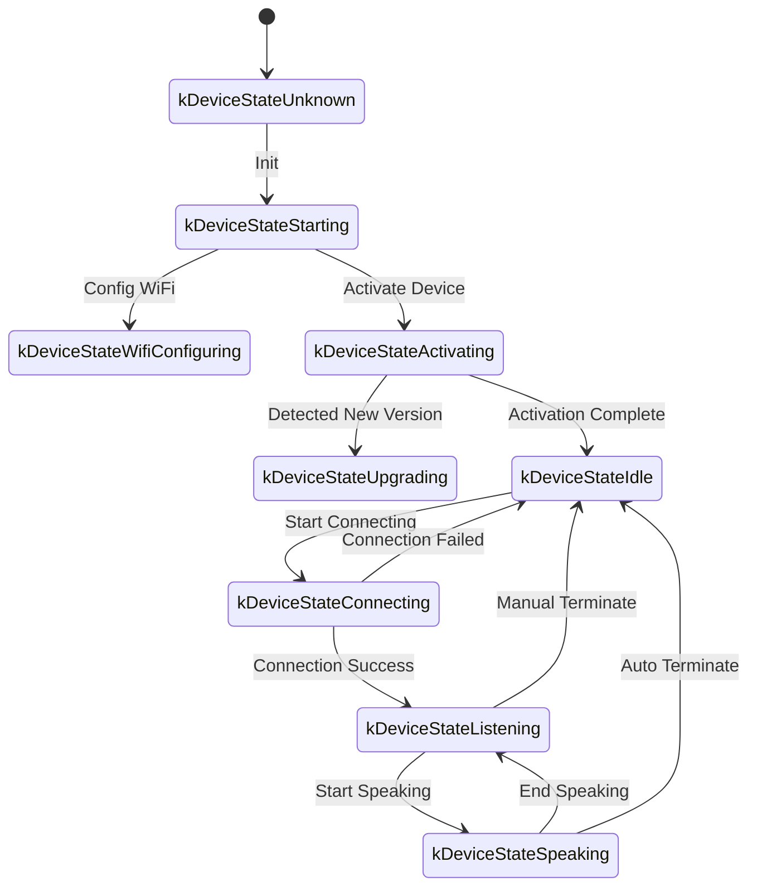
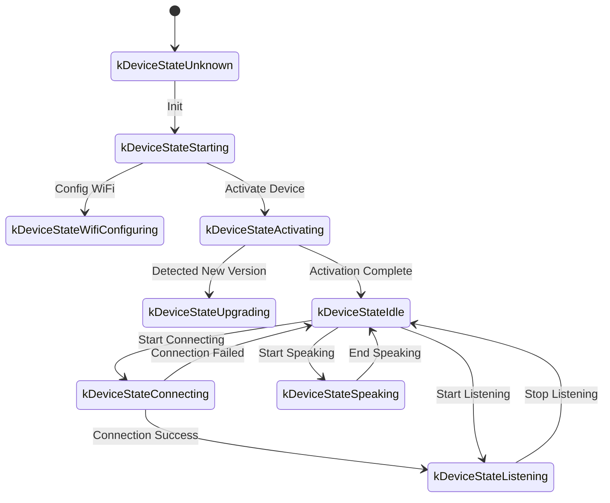

The following is a WebSocket communication protocol document compiled based on code implementation, outlining how the device and server interact via WebSocket.

This document is inferred solely from the provided code; actual deployment may require further confirmation or supplementation combined with the server-side implementation.

---

## 1. General Process Overview

1.  **Device Initialization**
    *   Device powers on, initializes `Application`:
        *   Initializes audio codec, display, LED, etc.
        *   Connects to the network.
        *   Creates and initializes the WebSocket protocol instance (`WebsocketProtocol`) implementing the `Protocol` interface.
    *   Enters the main loop waiting for events (audio input, audio output, scheduled tasks, etc.).

2.  **Establish WebSocket Connection**
    *   When the device needs to start a voice session (e.g., user wake-up, manual button trigger, etc.), it calls `OpenAudioChannel()`:
        *   Gets the WebSocket URL based on configuration.
        *   Sets several request headers (`Authorization`, `Protocol-Version`, `Device-Id`, `Client-Id`).
        *   Calls `Connect()` to establish a WebSocket connection with the server.

3.  **Device Sends "hello" Message**
    *   After a successful connection, the device sends a JSON message. Example structure:
    ```json
    {
      "type": "hello",
      "version": 1,
      "features": {
        "mcp": true
      },
      "transport": "websocket",
      "audio_params": {
        "format": "opus",
        "sample_rate": 16000,
        "channels": 1,
        "frame_duration": 60
      }
    }
    ```
    *   The `features` field is optional and generated automatically based on device compilation configuration. For example: `"mcp": true` indicates MCP protocol support.
    *   `frame_duration` corresponds to `OPUS_FRAME_DURATION_MS` (e.g., 60ms).

4.  **Server Replies "hello"**
    *   The device waits for the server to return a JSON message containing `"type": "hello"` and checks if `"transport": "websocket"` matches.
    *   The server may optionally send a `session_id` field, which the device will automatically record upon receipt.
    *   Example:
    ```json
    {
      "type": "hello",
      "transport": "websocket",
      "session_id": "xxx",
      "audio_params": {
        "format": "opus",
        "sample_rate": 24000,
        "channels": 1,
        "frame_duration": 60
      }
    }
    ```
    *   If matched, the server is considered ready, and the audio channel is marked as successfully opened.
    *   If no correct response is received within the timeout (default 10 seconds), the connection is considered failed, triggering a network error callback.

5.  **Subsequent Message Interaction**
    *   Two main types of data can be sent between the device and the server:
        1.  **Binary Audio Data** (Opus encoded)
        2.  **Text JSON Messages** (Used for transmitting chat status, TTS/STT events, MCP protocol messages, etc.)

    *   In the code, the receive callback is primarily divided into:
        *   `OnData(...)`:
            *   When `binary` is `true`, it is considered an audio frame; the device will decode it as Opus data.
            *   When `binary` is `false`, it is considered JSON text, which needs to be parsed by cJSON on the device side for corresponding business logic processing (such as chat, TTS, MCP protocol messages, etc.).

    *   When the server or network disconnects, `OnDisconnected()` is triggered:
        *   The device will call `on_audio_channel_closed_()` and eventually return to the idle state.

6.  **Close WebSocket Connection**
    *   When the device needs to end the voice session, it calls `CloseAudioChannel()` to actively disconnect and return to the idle state.
    *   Alternatively, if the server actively disconnects, it will trigger the same callback flow.

---

## 2. General Request Headers

In the code example, the following request headers are set when establishing a WebSocket connection:

*   `Authorization`: Used to store the access token, in the form `"Bearer <token>"`
*   `Protocol-Version`: Protocol version number, consistent with the `version` field in the hello message body
*   `Device-Id`: Device physical network card MAC address
*   `Client-Id`: Software-generated UUID (erasing NVS or re-flashing the full firmware will reset it)

These headers are sent to the server along with the WebSocket handshake, allowing the server to perform verification, authentication, etc., as needed.

---

## 3. Binary Protocol Version

The device supports multiple binary protocol versions, specified via the `version` field in the configuration:

### 3.1 Version 1 (Default)
Sends Opus audio data directly without extra metadata. The WebSocket protocol distinguishes between text and binary.

### 3.2 Version 2
Uses `BinaryProtocol2` structure:
```c
struct BinaryProtocol2 {
    uint16_t version;        // Protocol Version
    uint16_t type;           // Message Type (0: OPUS, 1: JSON)
    uint32_t reserved;       // Reserved
    uint32_t timestamp;      // Timestamp (ms, for server-side AEC)
    uint32_t payload_size;   // Payload Size (bytes)
    uint8_t payload[];       // Payload Data
} __attribute__((packed));
```

### 3.3 Version 3
Uses `BinaryProtocol3` structure:
```c
struct BinaryProtocol3 {
    uint8_t type;            // Message Type
    uint8_t reserved;        // Reserved
    uint16_t payload_size;   // Payload Size
    uint8_t payload[];       // Payload Data
} __attribute__((packed));
```

---

## 4. JSON Message Structure

WebSocket text frames are transmitted as JSON. The following are common `"type"` fields and their corresponding business logic. If a message contains unlisted fields, they may be optional or specific implementation details.

### 4.1 Device -> Server

1.  **Hello**
    *   Sent by the device after a successful connection to inform the server of basic parameters.
    *   Example:
      ```json
      {
        "type": "hello",
        "version": 1,
        "features": {
          "mcp": true
        },
        "transport": "websocket",
        "audio_params": {
          "format": "opus",
          "sample_rate": 16000,
          "channels": 1,
          "frame_duration": 60
        }
      }
      ```

2.  **Listen**
    *   Indicates the device starts or stops recording listening.
    *   Common fields:
        *   `"session_id"`: Session Identifier
        *   `"type": "listen"`
        *   `"state"`: `"start"`, `"stop"`, `"detect"` (Wake word detection triggered)
        *   `"mode"`: `"auto"`, `"manual"`, or `"realtime"`, indicating recognition mode.
    *   Example: Start listening
      ```json
      {
        "session_id": "xxx",
        "type": "listen",
        "state": "start",
        "mode": "manual"
      }
      ```

3.  **Abort**
    *   Terminates current speaking (TTS playback) or voice channel.
    *   Example:
      ```json
      {
        "session_id": "xxx",
        "type": "abort",
        "reason": "wake_word_detected"
      }
      ```
    *   `reason` value can be `"wake_word_detected"` or others.

4.  **Wake Word Detected**
    *   Used by the device to inform the server that a wake word was detected.
    *   Before sending this message, the wake word's Opus audio data can be sent in advance for server-side voiceprint detection.
    *   Example:
      ```json
      {
        "session_id": "xxx",
        "type": "listen",
        "state": "detect",
        "text": "Hello Xiaoming"
      }
      ```

5.  **MCP**
    *   Recommended new generation protocol for IoT control. All device capability discovery, tool calls, etc., are performed via messages with type: "mcp", where the payload is standard JSON-RPC 2.0 (see [MCP Protocol Document](./mcp-protocol.md) for details).
    
    *   **Example: Device sending result to Server:**
      ```json
      {
        "session_id": "xxx",
        "type": "mcp",
        "payload": {
          "jsonrpc": "2.0",
          "id": 1,
          "result": {
            "content": [
              { "type": "text", "text": "true" }
            ],
            "isError": false
          }
        }
      }
      ```

---

### 4.2 Server -> Device

1.  **Hello**
    *   Handshake confirmation message returned by the server.
    *   Must include `"type": "hello"` and `"transport": "websocket"`.
    *   May contain `audio_params`, indicating audio parameters expected by the server or configuration aligned with the device.
    *   The server may optionally send a `session_id` field, which the device will automatically record upon receipt.
    *   After successful reception, the device sets an event flag indicating the WebSocket channel is ready.

2.  **STT**
    *   `{"session_id": "xxx", "type": "stt", "text": "..."}`
    *   Indicates the server recognized user speech (e.g., Speech-to-Text result).
    *   The device may display this text on the screen before proceeding to answering flow.

3.  **LLM**
    *   `{"session_id": "xxx", "type": "llm", "emotion": "happy", "text": "😀"}`
    *   Server instructs the device to adjust emoji animation / UI expression.

4.  **TTS**
    *   `{"session_id": "xxx", "type": "tts", "state": "start"}`: Server is ready to send TTS audio; device enters "speaking" playback state.
    *   `{"session_id": "xxx", "type": "tts", "state": "stop"}`: Indicates current TTS has ended.
    *   `{"session_id": "xxx", "type": "tts", "state": "sentence_start", "text": "..."}`
        *   Lets the device display the text segment currently being played or read on the interface (e.g., for user display).

5.  **MCP**
    *   The server sends IoT-related control commands or returns call results via messages with type: "mcp", payload structure same as above.
    
    *   **Example: Server sending tools/call to Device:**
      ```json
      {
        "session_id": "xxx",
        "type": "mcp",
        "payload": {
          "jsonrpc": "2.0",
          "method": "tools/call",
          "params": {
            "name": "self.light.set_rgb",
            "arguments": { "r": 255, "g": 0, "b": 0 }
          },
          "id": 1
        }
      }
      ```

6.  **System**
    *   System control commands, commonly used for remote upgrades/updates.
    *   Example:
      ```json
      {
        "session_id": "xxx",
        "type": "system",
        "command": "reboot"
      }
      ```
    *   Supported commands:
        *   `"reboot"`: Restart device

7.  **Custom** (Optional)
    *   Custom messages, supported when `CONFIG_RECEIVE_CUSTOM_MESSAGE` is enabled.
    *   Example:
      ```json
      {
        "session_id": "xxx",
        "type": "custom",
        "payload": {
          "message": "Custom Content"
        }
      }
      ```

8.  **Audio Data: Binary Frame**
    *   When the server sends audio binary frames (Opus encoded), the device decodes and plays them.
    *   If the device is in "listening" (recording) state, received audio frames will be ignored or cleared to prevent conflicts.

---

## 5. Audio Codec

1.  **Device Sends Recording Data**
    *   Audio input, after potential echo cancellation, noise reduction, or volume gain, is Opus encoded and packed into binary frames sent to the server.
    *   Depending on the protocol version, it may send Opus data directly (Version 1) or use a binary protocol with metadata (Version 2/3).

2.  **Device Plays Received Audio**
    *   When receiving binary frames from the server, they are also recognized as Opus data.
    *   The device will decode them and pass them to the audio output interface for playback.
    *   If the server's audio sample rate does not match the device, resampling is performed after decoding.

---

## 6. Common State Transitions

The following are key device state transitions corresponding to WebSocket messages:

1.  **Idle** -> **Connecting**
    *   After user trigger or wake-up, device calls `OpenAudioChannel()` -> Establish WebSocket connection -> Send `"type":"hello"`.

2.  **Connecting** -> **Listening**
    *   After connection is established, if `SendStartListening(...)` continues to execute, it enters the recording state. The device will continuously encode microphone data and send it to the server.

3.  **Listening** -> **Speaking**
    *   Received Server TTS Start message (`{"type":"tts","state":"start"}`) -> Stop recording and play received audio.

4.  **Speaking** -> **Idle**
    *   Server TTS Stop (`{"type":"tts","state":"stop"}`) -> Audio playback ends. If automatic listening is not configured, return to Idle; if auto-loop is configured, re-enter Listening.

5.  **Listening** / **Speaking** -> **Idle** (Exception or Active Interruption)
    *   Call `SendAbortSpeaking(...)` or `CloseAudioChannel()` -> Interrupt session -> Close WebSocket -> Return to Idle state.

### Auto Mode State Transition Diagram



### Manual Mode State Transition Diagram



---

## 7. Error Handling

1.  **Connection Failure**
    *   If `Connect(url)` returns failure or times out waiting for the server "hello" message, the `on_network_error_()` callback is triggered. The device will prompt "Unable to connect to service" or similar error information.

2.  **Server Disconnection**
    *   If the WebSocket disconnects abnormally, callback `OnDisconnected()`:
        *   Device callbacks `on_audio_channel_closed_()`
        *   Switch to Idle or other retry logic.

---

## 8. Other Notes

1.  **Authentication**
    *   The device provides authentication by setting `Authorization: Bearer <token>`, which the server side needs to verify.
    *   If the token is expired or invalid, the server can refuse the handshake or disconnect subsequently.

2.  **Session Control**
    *   Some messages in the code contain `session_id`, used to distinguish independent conversations or operations. The server can handle different sessions separately as needed.

3.  **Audio Payload**
    *   The code defaults to using Opus format, setting `sample_rate = 16000`, mono. Frame duration is controlled by `OPUS_FRAME_DURATION_MS`, typically 60ms. Adjustments can be made based on bandwidth or performance. For better music playback, the server downlink audio might use 24000 sample rate.

4.  **Protocol Version Configuration**
    *   Configure binary protocol version (1, 2, or 3) via the `version` field in settings.
    *   Version 1: Directly send Opus data
    *   Version 2: Use binary protocol with timestamps, suitable for server-side AEC
    *   Version 3: Use simplified binary protocol

5.  **IoT Control Recommends MCP Protocol**
    *   It is recommended that IoT capability discovery, state synchronization, control instructions, etc., between device and server be implemented entirely via the MCP protocol (type: "mcp"). The original type: "iot" scheme is deprecated.
    *   MCP protocol can be transmitted over various underlying protocols like WebSocket, MQTT, etc., offering better extensibility and standardization.
    *   See [MCP Protocol Document](./mcp-protocol.md) and [MCP IoT Control Usage](./mcp-usage.md) for detailed usage.

6.  **Error or Malformed JSON**
    *   When JSON lacks necessary fields, e.g., `{"type": ...}`, the device logs an error (`ESP_LOGE(TAG, "Missing message type, data: %s", data);`) and will not execute any business logic.

---

## 9. Message Example

Below is a typical bidirectional message example (Simplified flow):

1.  **Device -> Server** (Handshake)
    ```json
    {
      "type": "hello",
      "version": 1,
      "features": {
        "mcp": true
      },
      "transport": "websocket",
      "audio_params": {
        "format": "opus",
        "sample_rate": 16000,
        "channels": 1,
        "frame_duration": 60
      }
    }
    ```

2.  **Server -> Device** (Handshake Response)
    ```json
    {
      "type": "hello",
      "transport": "websocket",
      "session_id": "xxx",
      "audio_params": {
        "format": "opus",
        "sample_rate": 16000
      }
    }
    ```

3.  **Device -> Server** (Start Listening)
    ```json
    {
      "session_id": "xxx",
      "type": "listen",
      "state": "start",
      "mode": "auto"
    }
    ```
    Device starts sending binary frames (Opus data) simultaneously.

4.  **Server -> Device** (ASR Result)
    ```json
    {
      "session_id": "xxx",
      "type": "stt",
      "text": "Words spoken by user"
    }
    ```

5.  **Server -> Device** (TTS Start)
    ```json
    {
      "session_id": "xxx",
      "type": "tts",
      "state": "start"
    }
    ```
    Then server sends binary audio frames to device for playback.

6.  **Server -> Device** (TTS End)
    ```json
    {
      "session_id": "xxx",
      "type": "tts",
      "state": "stop"
    }
    ```
    Device stops playing audio; if no further instructions, returns to idle state.

---

## 10. Summary

This protocol transmits JSON text and binary audio frames over WebSocket, completing functions including audio stream upload, TTS audio playback, speech recognition and state management, MCP instruction issuing, etc. Its core features:

*   **Handshake Phase**: Send `"type":"hello"`, wait for server return.
*   **Audio Channel**: Bidirectional voice stream transmission using Opus encoded binary frames, supporting multiple protocol versions.
*   **JSON Messages**: Use `"type"` as the core field to identify different business logic, including TTS, STT, MCP, WakeWord, System, Custom, etc.
*   **Extensibility**: Fields can be added to JSON messages as needed, or extra authentication performed in headers.

The server and device need to agree on the field meanings, timing logic, and error handling rules of various messages in advance to ensure smooth communication. The above information serves as a basic document for subsequent docking, development, or extension.
